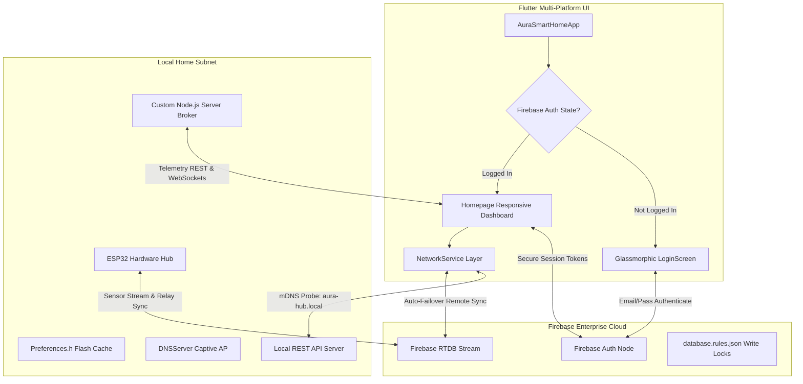

# Aura Smart Home (AURA IoT)
### Symmetrical Multi-Platform Web Panel • ESP32 Smart Firmware • Realtime Failover Engine

[](https://github.com/AlajeBash/smart_home_project/actions)
[](LICENSE)

Aura Smart Home is a premium, enterprise-grade, high-fidelity IoT dashboard and micro-controller suite. It features **symmetrical glassmorphic UX** across Mobile, Tablet, and Desktop form factors, an **offline direct-subnet auto-discovery failover engine**, and **dynamic hardware pin registration** directly from the cloud.

#### 🌐 Deployed Live Demography
* **Primary Live Web Panel**: [https://bash-smart-home-esp32.web.app/](https://bash-smart-home-esp32.web.app/)
* **Secondary Mirror**: [https://bash-smart-home-esp32.firebaseapp.com/](https://bash-smart-home-esp32.firebaseapp.com/)

---

## 🗺️ Complete Enterprise Architecture

The architecture represents a robust, highly resilient, triple-layer modern IoT topology:



---

## ⚡ Key Feature Suites

### 1. Offline Direct-Subnet Auto-Discovery (`mDNS` & Failover)
* **Local mDNS Responder**: The ESP32 hosts a multicast DNS server at `http://aura-hub.local` on Port `80`.
* **Zero-Latency Failover (`NetworkService`)**: The Flutter web app continuously pings `aura-hub.local`. 
  * If reachable, communication is hot-swapped to fast local HTTP REST endpoints (`/api/sensors` and `/api/device`), fully bypassing internet roundtrips.
  * If unreachable, it seamlessly reconnects to the Firebase Realtime Database stream without interrupting UI operations.

### 2. Captive Portal Hotspot Provisioning
* **Secure Flash Storage (`Preferences.h`)**: SSID, Wi-Fi passwords, Firebase DB URLs, and API tokens are dynamically stored in secure non-volatile storage (NVS) blocks.
* **Captive Hotspot Portal**: If connection configurations are missing or connection attempts time out (20 seconds), the ESP32 launches an open Access Point named **`AURA-SmartHub-Setup`**. 
* **Commissioning Dashboard**: Connect to `http://192.168.4.1` to access a high-fidelity glassmorphic commissioning webpage to scan local networks, insert credentials, and trigger a self-healing reboot.

### 3. Symmetrical Multi-Viewport Glassmorphic UI
* **High-Fidelity Aesthetics**: Neon glow systems, real-time backdrop-filters, custom color palettes, and fluid hover animations.
* **Layout Symmetries**:
  * **Mobile View (`mobile_body.dart`)**: Slide-out glassmorphic drawer menu, linear status filter widgets, and double-filtered device lists.
  * **Tablet View (`tablet_body.dart`)**: Compact vertical navigation rail with neon active state indicator pips, multi-row analytics summary dashboard.
  * **Desktop View (`desktop_body.dart`)**: 3-column layout featuring Sidebar Navigation, Center dashboard view, and Diagnostic logging streams that dynamically collapse to accommodate intensive interfaces.

### 4. Dynamic Device & Hardware Pin Decoupling
* **Dynamic Database Provisioning**: Appliances are dynamically loaded from `/home/devices/`. New devices are provisioned, toggled, or deleted at runtime with zero code modification.
* **GPIO Selector**: When registering an appliance, select between wireless connectivity or a **Wired Pin**, mapping it directly to physical microcontroller GPIO ports (e.g., GPIO 2, 12, 13, 15, etc.).
* **Self-Healing Driver Mode**: The ESP32 parses newly added database devices, automatically runs `pinMode(port, OUTPUT)` at runtime, and drives relay signals high or low instantly on command.

### 5. Multi-Tab Interactive Modules
* **Dashboard & Status Filters**: Filter home nodes dynamically using horizontal filter chips (All, Online, Offline, Faulty) accompanied by visual green, grey, or red inline pulsing status badges.
* **Rooms Hub & Appliances Relocation**: Drag-and-drop or select to swap appliance room locations. Add or delete custom rooms instantly, updating configuration templates globally.
* **Automations Builder Console**: Instant scene templates ("Cinema Mode", "All Lights Off", "Energy Save") alongside custom rules construction (e.g. `If temperature is > 30°C, then turn on Air Conditioner`).
* **Security Control Deck**: Virtual numeric keypad verifying custom sequence codes (`1234`) to switch state between **ARMED** and **DISARMED**. Integrates live visual streams with custom static scanline noise and distortion shaders.
* **Analytics Climate Trends**: Renders temperature and humidity historical datasets using a clean pure-canvas Custom Painter (`CustomPainter`), linked to a real-time system event log terminal.

---

## 📂 Repository Layout

```bash
├── backend/                             # Custom Telemetry Broker
│   ├── database.rules.json              # Firebase JWT Database Write-Locks
│   ├── server.js                        # Node.js + Socket.io Server
│   └── package.json
│
├── firmware/                            # ESP32 Smart Firmware Suite
│   └── esp32/
│       └── Smart_Home.cpp               # Captive AP, mDNS, NVS & Failover
│
└── frontend/                            # Flutter Responsive Web App
    ├── lib/
    │   ├── main.dart                    # Auth State Stream Listener
    │   ├── homepage.dart                # Main Symmetrical Layout Router
    │   ├── Network/
    │   │   └── network.dart             # Failover REST Client & Sync Engine
    │   └── Responsive/
    │       ├── mobile_body.dart         # Mobile UI viewport
    │       ├── tablet_body.dart         # Tablet UI viewport
    │       └── desktop_body.dart        # Desktop UI viewport
    ├── firebase.json                    # Single Page App URL Redirect Rules
    └── pubspec.yaml
```

---

## 🛠️ Step-by-Step Commissioning & Setup

### 1. Firebase Backend Provisioning
1. Create a project at [Firebase Console](https://console.firebase.google.com/).
2. Enable **Realtime Database** and **Firebase Authentication** (Email/Password provider).
3. Import security write-locks into your Realtime Database rules using [backend/database.rules.json](file:///home/alajebash/Desktop/Aminai%20Technologies/Iot/Smart%20Home/backend/database.rules.json):
   ```json
   {
     "rules": {
       ".read": "auth != null",
       ".write": "auth != null"
     }
   }
   ```

### 2. Flashing the Microcontroller
1. Connect your ESP32 board to your development environment.
2. Open [firmware/esp32/Smart_Home.cpp](file:///home/alajebash/Desktop/Aminai%20Technologies/Iot/Smart%20Home/firmware/esp32/Smart_Home.cpp) in PlatformIO or Arduino IDE.
3. Install required libraries:
   * `ESP32 REST Client / WebServer`
   * `ESPmDNS`
   * `Preferences` (NVS)
   * `ArduinoJson` (JSON streams parser)
4. Upload the code to your ESP32.
5. Search for the Wi-Fi network **`AURA-SmartHub-Setup`** on your smartphone.
6. Input your home Wi-Fi SSID, password, Firebase Host url (`https://<project-id>.firebaseio.com`), and Web API Key, then click **Commission & Reboot**.

### 3. Local Broker Execution (Optional)
If running a secondary local server broker for telemetry sockets:
```bash
cd backend
npm install
node server.js
```

### 4. Running the Flutter Frontend Locally
Ensure your local machine has the Flutter SDK configured:
```bash
cd frontend
flutter pub get
flutter run -d chrome
```
*Alternatively, click **Bypass Authentication (Demo Mode)** on the premium login screen to interactively preview all UI views, chart animations, security panels, and room filters with high-fidelity simulated telemetry datasets.*

---

## 🚀 Continuous Integration & Deployment (CI/CD)

The project utilizes automated GitHub Actions pipelines:
* **Workflow**: Every push or merge directly to the `main` branch triggers the deployment pipeline.
* **Process**: Installs Java JDK 17, pulls the stable Flutter SDK, builds the production web distribution bundle (`flutter build web --release`), and deploys the resulting static assets directly to **Firebase Web Hosting** using a secure Github repository secret service-account key (`FIREBASE_SERVICE_ACCOUNT_BASH_SMART_HOME_ESP32`).

---

## 📝 License & Contacts
This software is commercial and proprietary. Distributed under the Aminai Technologies Proprietary Software License. See [LICENSE](LICENSE) for the full commercial terms and restrictions.

* **Maintainer**: AlajeBash
* **Repository**: [https://github.com/AlajeBash/smart_home_project](https://github.com/AlajeBash/smart_home_project)
